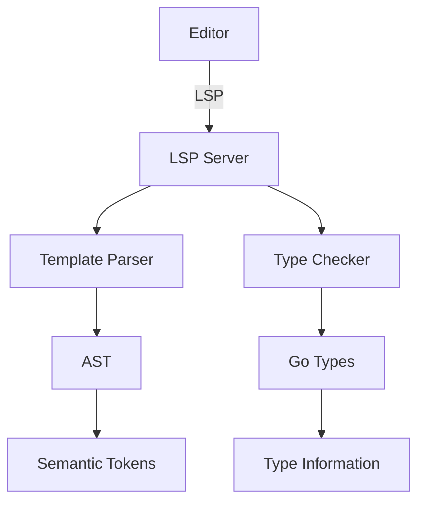

# Go Template Types VSCode Extension 🚀

A powerful Language Server Protocol (LSP) implementation for Go templates with type checking and advanced features.

```ascii
                  +------------------+
                  |   VSCode/Editor  |
                  +--------+---------+
                           |
                           | LSP Protocol
                           |
                  +--------+---------+
                  |  Template LSP    |
                  |     Server       |
                  +--------+---------+
                           |
             +------------+------------+
             |                        |
    +--------+--------+     +--------+--------+
    |   Go Template   |     |   Type System   |
    |     Parser      |     |    Analyzer     |
    +----------------+      +----------------+
```

## Features 🌟

-   🎯 Go template parsing and validation
-   🔍 Type checking for template variables
-   💡 Intelligent code completion
-   📝 Hover information
-   🎨 Semantic token highlighting
-   🐛 Error diagnostics
-   🔄 Live template validation

## Semantic Token Support 🎨

The extension provides rich semantic highlighting for:

```go
{{ .Name }}     // Variable access
{{ .GetAge }}   // Method calls
{{ if .Ready }} // Keywords
{{ range . }}   // Block delimiters
```

Supported token types:

-   Delimiters (`{{`, `}}`)
-   Functions
-   Variables
-   Types
-   Strings
-   Comments
-   Keywords
-   Operators

## Installation 📦

1. Install the extension from VSCode marketplace
2. Make sure you have Go installed
3. Open a workspace with Go templates

## Usage 💻

1. Create a Go template file (`.tmpl` or `.gotmpl`)
2. Add type annotations:
    ```go
    {{- /*gotype: mypackage.MyType*/ -}}
    {{ .Field }}
    ```
3. Enjoy rich IDE features!

## Development 🛠️

### Prerequisites

-   Go 1.21+
-   VSCode

### Building

```bash
# Install dependencies
go mod tidy

# Run tests
go test ./...

# Build the extension
task build
```

### Architecture 🏗️



## Contributing 🤝

1. Fork the repository
2. Create a feature branch
3. Commit your changes
4. Push to the branch
5. Create a Pull Request

## License 📄

MIT License - see LICENSE file for details
